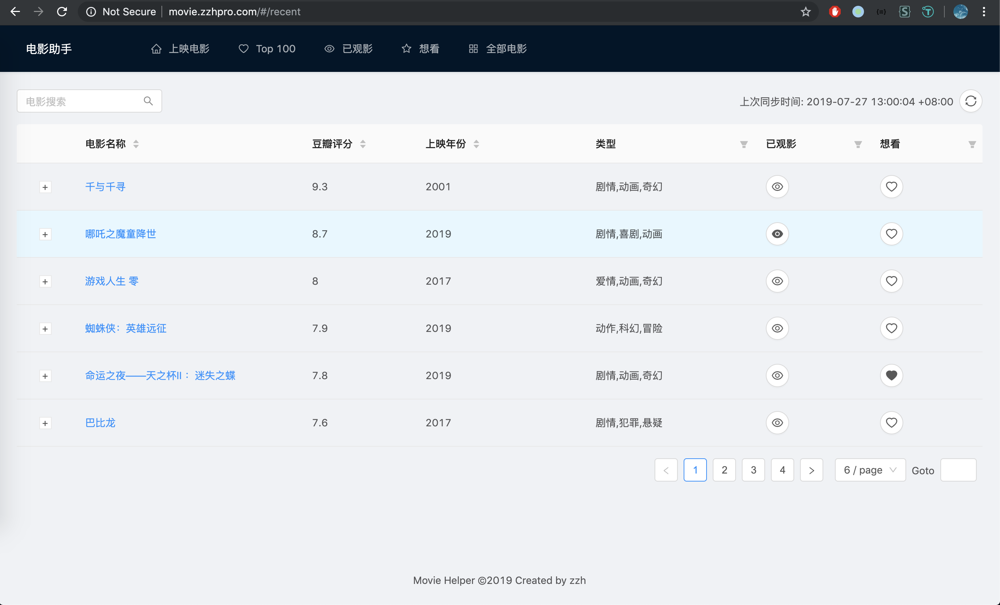
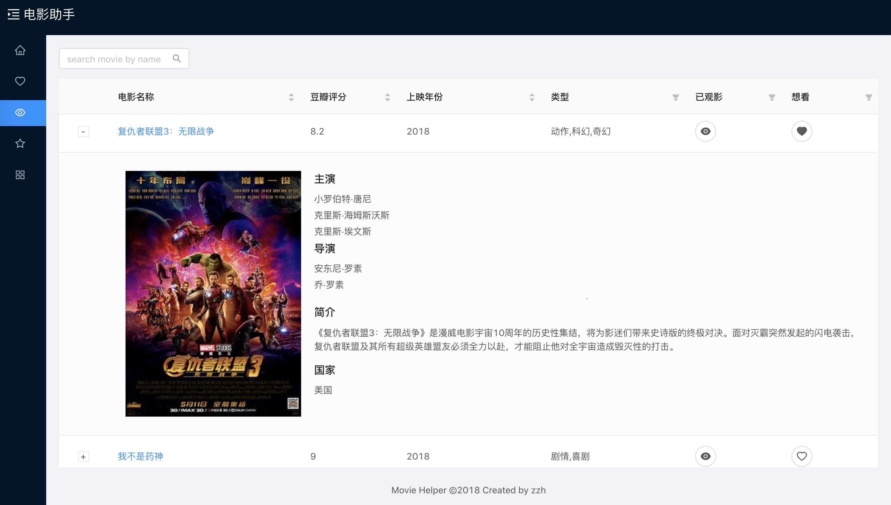

# Movie Helper Front

<p align="center">
    <a href="http://movie.zzhpro.com">
        
    </a>
    <h3 align="center">Movie Helper Front</h3>
    <p align="center">
        
        <a href="https://github.com/zzh1991/movie-helper-front/blob/master/LICENSE"></a>
        <a href="#"></a>
        <a href="#"></a>
    </p>
    <p align="center">
        Movie management and find valueable movies to watch<br>
    </p>
</p>

## 🚀 Usage

- `npm install`: install dependency
- `npm run start`
- go to http://localhost:3000
- `npm run deploy` to build

## Demo: [Movie Helper](http://movie.zzhpro.com)

### Recent Movies



### Top 100 Movies


### Viewed Movies



### Stared Movies(Want to watch)


### All Movies


## Todo

- [x] upgrade antd3
- [x] redesign layout
- [x] support dark mode
- [x] support antd4

## Dependency

- react
- redux
- react-router-dom
- react-redux
- redux-thunk
- redux-saga
- [ant design](https://ant.design)
- [ant design pro layout](https://github.com/ant-design/ant-design-pro-layout)
- day.js
- webpack 4
- @babel 7
- eslint
- styled-components

## Problems

### React router v4 HashRouter

- install react-router-dom

```javascript
<HashRouter>
  <div>
    <Route exact path="/" component={App} />
    <Route path="/app" component={App} />
  </div>
</HashRouter>

// this.props.history.push('path');
```

### webpack

#### babel

- arrow function: transform-class-properties
- async: "transform-runtime", { "polyfill": false, "regenerator": true }

### [Parcel](https://parceljs.org/)

## Author

👤 **Zhihao Zhang**

- Github: [@zzh1991](https://github.com/zzh1991)

## Show your support

Please ⭐️ this repository if this project helped you!

## 📝 License

Copyright © 2023 [zzh1991](https://github.com/zzh1991).<br />
This project is [MIT](https://github.com/zzh1991/movie-helper-front/blob/master/LICENSE) licensed.
